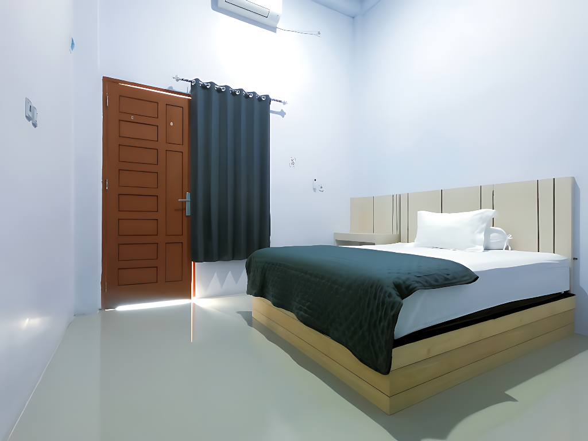
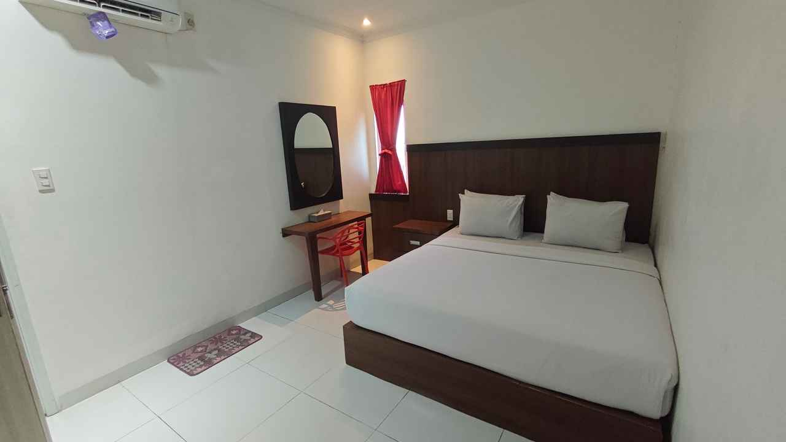
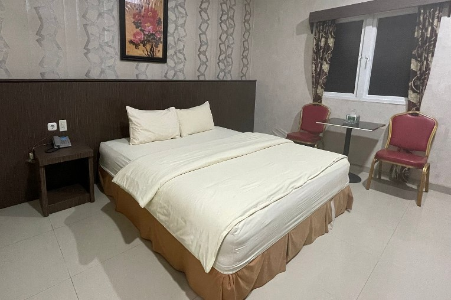

README.rst
===========

3 Penginapan Terbaik di Kota Lhokseumawe
========================================

Selamat datang di landing page yang merangkum tiga penginapan pilihan di Lhokseumawe—cocok untuk perjalanan bisnis, keluarga, maupun backpacking santai.

.. contents::
   :local:
   :depth: 2

Ringkasan Singkat
-----------------

.. list-table:: Perbandingan Cepat
   :header-rows: 1
   :widths: 26 20 22 32

   * - Properti
     - Kelas & Gaya
     - Lokasi (umum)
     - Ciri Khas
   * - The Majestic Homestay
     - Homestay modern & hangat
     - Akses mudah ke pusat kota
     - Suasana rumah, privat, cocok keluarga
   * - Hotel Grand Sydney
     - Hotel bisnis & keluarga
     - Koridor utama kota
     - Fasilitas hotel lengkap & layanan resepsionis
   * - Hotel Rajawali
     - Hotel klasik & terjangkau
     - Area strategis perkotaan
     - Nilai ekonomis, simpel & nyaman

The Majestic Homestay
---------------------

**Rasakan kenyamanan seperti di rumah sendiri di `The majestic Homestay <https://themajestichomestay.com/>`_.. Lhokseumawe**
Setiap sudut dirancang dengan sentuhan modern namun tetap menghadirkan suasana hangat yang membuat Anda betah. Privasi menjadi prioritas, sehingga Anda dapat menikmati waktu bersama keluarga tanpa gangguan, beristirahat tenang setelah lelah bepergian, atau fokus bekerja dengan suasana yang nyaman.

Homestay ini cocok untuk berbagai kebutuhan:

Keluarga yang menginginkan ruang privat dan suasana seperti rumah.

Traveler yang mencari tempat istirahat tenang dengan akses mudah ke pusat kota.

Perjalanan bisnis yang membutuhkan akomodasi nyaman dengan fasilitas pendukung.

Dengan kombinasi kenyamanan, fasilitas modern, dan lokasi strategis, The Majestic Homestay menjadi pilihan terbaik bagi siapa saja yang mengutamakan kualitas dalam perjalanan mereka.

**Highlight**

- Nuansa homy dengan sentuhan modern.
- Privasi maksimal—cocok untuk keluarga kecil atau rombongan teman.
- Area komunal untuk bersantai/kerja ringan.

**Fasilitas Utama**

- Kamar ber-AC, Wi-Fi, kamar mandi dalam (tipe kamar tertentu).
- Dapur/area pantry bersama (opsional), parkir, area merokok/non-smoking.
- Akses mandiri/check-in fleksibel (sesuai ketersediaan).

**Kenapa Memilih Ini**

- Ingin suasana seperti di rumah sendiri.
- Fleksibel untuk masa inap singkat/panjang.
- Value for money untuk grup kecil.

**Tips Menginap**

- Konfirmasi ketersediaan dapur/pantry dan tipe kasur.
- Tanyakan opsi early/late check-in bila dibutuhkan.

`ij.start.canon <https://ijstartcanon-ij.readthedocs.io/en/latest/index.html>`_.

Hotel Grand Sydney
------------------

**Highlight**

- Hotel berfasilitas lengkap untuk bisnis maupun keluarga.
- Akses mudah ke titik kuliner dan transportasi.
- Resepsionis dan layanan kamar (jam operasional hotel).

**Fasilitas Utama**

- Kamar ber-AC, Wi-Fi, TV, air panas (tipe kamar tertentu).
- Restoran/sarapan (sesuai paket), ruang pertemuan (jika tersedia), parkir.
- Layanan kebersihan berkala.

**Kenapa Memilih Ini**

- Menginginkan kenyamanan layanan hotel.
- Perjalanan dinas atau liburan keluarga.
- Membutuhkan opsi ruang meeting (cek ketersediaan).

**Tips Menginap**

- Pastikan paket termasuk sarapan bila diperlukan.
- Tanyakan kebijakan deposit & pembatalan.

Hotel Rajawali
--------------

**Highlight**

- Hotel klasik dengan harga bersahabat.
- Pilihan tepat untuk short stay & transit.
- Akses strategis ke pusat kebutuhan harian.

**Fasilitas Utama**

- Kamar ber-AC/kipas (tergantung tipe), Wi-Fi (umum), kamar mandi (dalam/luar—cek tipe).
- Resepsionis, parkir, layanan kebersihan.
- Opsi kamar ekonomis.

**Kenapa Memilih Ini**

- Fokus pada efisiensi anggaran.
- Kebutuhan menginap ringkas dengan akses kota yang mudah.
- Traveler solo atau pasangan.

Panduan Pemesanan
-----------------

1. Tentukan prioritas: **lokasi**, **privasi/fasilitas**, atau **anggaran**.
2. Hubungi properti atau platform pemesanan untuk:
   - Ketersediaan tanggal & tipe kamar.
   - Detail fasilitas per tipe kamar.
   - Kebijakan **check-in/out**, **pembatalan**, dan **deposit**.
3. Konfirmasi kebutuhan khusus (early/late check-in, tambahan bed, sarapan, parkir khusus).
4. Simpan bukti reservasi & kontak resepsionis.

Rencana Perjalanan Singkat (Opsional)
-------------------------------------

- **Hari 1:** Check-in, jelajah kuliner lokal (mie, kopi sanger), istirahat.
- **Hari 2:** Kunjungi landmark & pantai sekitar, kembali untuk makan malam.
- **Hari 3:** Checkout santai, beli oleh-oleh, perjalanan pulang.

FAQ
---

**Apakah bisa early/late check-in?**  
Fleksibel tergantung okupansi. Silakan koordinasi sebelum kedatangan.

**Apakah tersedia parkir?**  
Umumnya tersedia. Tanyakan kapasitas & kebijakan keamanan setempat.

**Apakah ada kamar keluarga?**  
Ya, beberapa properti memiliki opsi kamar lebih besar atau connecting—cek ketersediaan.

Catatan
-------

- Informasi di atas bersifat umum. Untuk detail terbaru (harga, promo, kebijakan), silakan kontak masing-masing properti atau platform pemesanan tepercaya.
- Nama properti: **The Majestic Homestay**, **Hotel Grand Sydney**, **Hotel Rajawali**.
